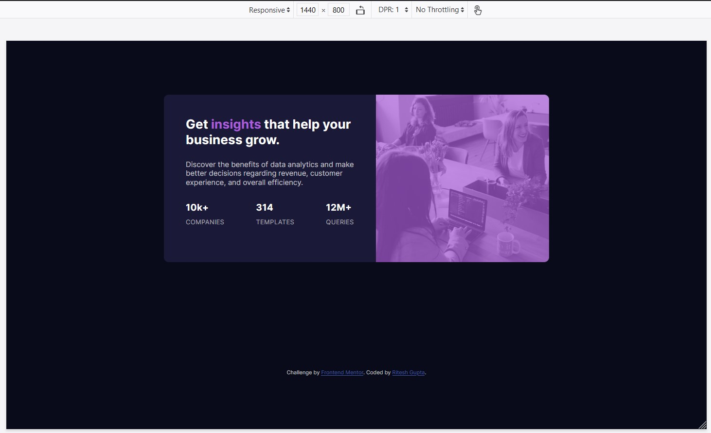

# Frontend Mentor - Stats preview card component solution

This is a solution to the [Stats preview card component challenge on Frontend Mentor](https://www.frontendmentor.io/challenges/stats-preview-card-component-8JqbgoU62). Frontend Mentor challenges help you improve your coding skills by building realistic projects.

## Table of contents

- [Overview](#overview)
  - [The challenge](#the-challenge)
  - [Screenshot](#screenshot)
  - [Links](#links)
  - [Built with](#built-with)
  - [What I learned](#what-i-learned)
- [Author](#author)

**Note: Delete this note and update the table of contents based on what sections you keep.**

## Overview

This was a Frontend mentor challenge to make a preview card component.

### The challenge

Users should be able to:

- View the optimal layout depending on their device's screen size
- Design:
- Mobile layout - 
- Desktop layout - 

### Screenshot

### Links

- Solution URL: [Solution](https://www.frontendmentor.io/solutions/stats-card-preview-component-html-css-grid-flex-media-queries-NLJ2X7t1z)
- Live Site URL: [Live site](https://b4n1y4.github.io/stats-preview-card-component-main/)

### Built with

- Semantic HTML5 markup
- CSS custom properties
- Flexbox
- CSS Grid
- Mobile-first workflow

### What I learned

Utilized flexbox order for the forst time and the overlay on header.

## Author

- Website - [Ritesh Gupta](https://github.com/b4n1y4)
- Frontend Mentor - [@b4n1y4](https://www.frontendmentor.io/profile/b4n1y4)
- Twitter - [@b4n1y4](https://www.twitter.com/b4n1y4)
